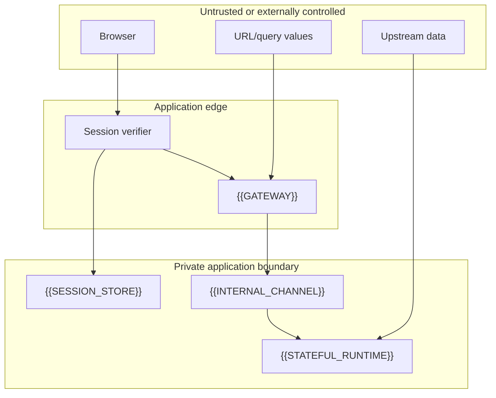

# Vocabulary and Trust Boundaries

The design is secure only when each boundary has one owner and one
responsibility. The browser is an untrusted caller even when it displays a
signed-in UI. The stateful runtime is not allowed to infer authorization from
an arbitrary browser path, query value, or forwarded header.

## Actors and zones

| Actor or zone | Trust level | Owns | Must not decide |
| --- | --- | --- | --- |
| Browser | Untrusted | UI state and a request to use a resource | principal identity, resource ownership, internal claims |
| Authorization server | External trust anchor | authentication result and provider claims | application resource ownership |
| Session boundary | Application trust boundary | opaque session lookup, expiry, revocation | provider-specific UI state |
| Public gateway | Application trust boundary | origin/CSRF, session, challenge, pause, and ownership checks | durable state reconstruction |
| Internal channel | Private authenticated boundary | service-to-service authenticity and request forwarding | browser intent |
| Stateful runtime | Resource-scoped trust boundary | handoff validation, durable state, serialized work | accepting browser credentials directly |
| Upstream dependency | Untrusted dependency | evidence, data, or provider work | session or ownership policy |
| Observability sink | Restricted output boundary | allowlisted lifecycle events | raw request or credential retention |

## Threats and required controls

| Threat | What can go wrong | Required invariant |
| --- | --- | --- |
| Query-string exposure | Browser history, referrers, logs, monitoring, or screenshots capture a bearer credential | Never put a reusable bearer, JWT, session ID, or private claim in a browser URL |
| Cookie theft or XSS | A script or malware obtains a browser session secret | Use server-owned opaque sessions, `HttpOnly`, `Secure`, appropriate `SameSite`, rotation, and revocation; treat XSS as a separate control |
| CSRF or origin confusion | A third-party page causes a credentialed state change | Check the exact Origin/CSRF policy on every state-changing browser request |
| Confused deputy | A valid principal reaches another principal’s resource | Recheck ownership at preparation, upgrade, and runtime handoff |
| Forged internal assertion | Browser-supplied identity headers are trusted downstream | Authenticate the internal channel and overwrite, never merge, protected headers |
| Replay or stale authorization | An old session or handoff remains valid after logout, disablement, or epoch change | Check session status and authorization epoch at the gateway and runtime |
| Hibernation state loss | In-memory identity or authorization disappears after restart | Persist the minimum authoritative state and rehydrate before work |
| Upstream outage | MCP/provider discovery throws during connection setup | Keep upstream I/O out of startup/handshake; return a bounded post-connect failure |
| Deploy skew | One side expects a contract the other side does not implement | Deploy private target before caller, keep compatibility windows explicit, then remove old paths |
| Telemetry leakage | Logs or browser artifacts retain URLs, cookies, prompts, or provider payloads | Allowlist fields, redact values before storage, and exclude traces/HARs by default |

## Invariants to carry into an adapter

1. A correlation ID is never a capability.
2. Every authorization decision names both a principal and a resource.
3. The public boundary owns browser-origin and session checks.
4. The private boundary owns service authentication and header normalization.
5. The stateful runtime rejects a handoff whose resource binding does not match
   its own address.
6. Durable state is the source of truth after hibernation or restart.
7. A failed dependency produces a bounded error at the layer that owns it.
8. Observability can correlate lifecycle events without reconstructing secrets.
9. A rollback cannot silently reintroduce a retired credential path.
10. Evidence states whether it describes source, build, deployment, or live use.

## Adapter worksheet

Before adopting the blueprint, record:

- `{{PRINCIPAL}}`: stable subject identifier and its issuer;
- `{{SESSION_STORE}}`: storage and lookup/revocation owner;
- `{{GATEWAY}}`: public HTTP/WebSocket boundary;
- `{{INTERNAL_CHANNEL}}`: service binding, mTLS, signed envelope, or equivalent;
- `{{STATEFUL_RUNTIME}}`: one actor per resource or another explicit scope;
- `{{RESOURCE_ID}}`: path-safe resource identifier;
- `{{AUTHORIZATION_EPOCH}}`: revocation/version mechanism;
- `{{OBSERVABILITY_SINK}}`: redacted log/event destination;
- `{{UPSTREAM}}`: dependency that must remain outside handshake setup.

Current platform mappings are intentionally kept in
[[authenticated-identity-blueprint/08-cloudflare-adapter|the adapter note]].
