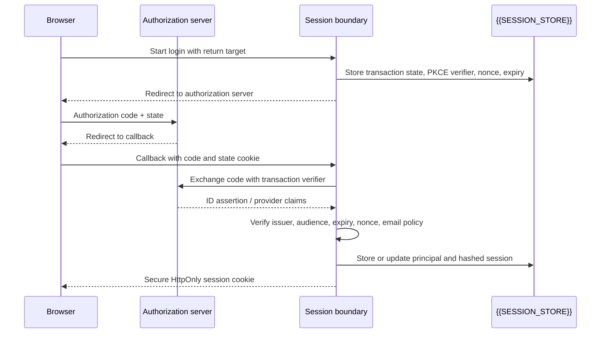

# Authentication and Session Lifecycle

Use a server-owned session as the browser’s durable proof of authentication.
The browser may initiate an authorization-code flow, but it should not hold a
reusable realtime bearer credential.

## Provider-independent flow



The exact provider is an adapter choice. For browser authorization-code
clients, use a transaction-specific state value, a transaction-specific nonce
where applicable, an S256 PKCE challenge, exact redirect URI matching, and
single-use transaction records. The authorization server’s access or refresh
tokens stay server-side and are not persisted unless the application has a
separate reviewed need.

## Session contract

The session boundary should expose a small conceptual interface:

```text
lookup(cookie) -> Session | absent
authorize(session, resourceId) -> AuthorizedResource | bounded failure
revoke(session) -> success
revokePrincipal(principal) -> success
currentEpoch(principal) -> epoch
```

A session record normally contains an opaque identifier hash, principal
reference, creation/expiry timestamps, last-seen data, revocation state, and
the current challenge state. Never put the raw session value, provider
assertion, or private claim in a URL or log.

A browser session cookie should be Secure and HttpOnly, use an appropriate
SameSite policy, and be host-scoped where possible. SameSite is defense in
depth; it does not replace an explicit Origin or CSRF check for state-changing
requests. Do not store authentication credentials in localStorage or
sessionStorage.

## Additional access gates

A bot-verification challenge, device posture, step-up authentication, or
administrator pause is a separate gate from identity. Record its verified
state server-side and recheck it before preparation and upgrade. A full quota
or provider capacity condition should not be confused with session
authentication; return a bounded application response while preserving
read-only history when the product allows it.

## Logout, revocation, and epochs

Logout revokes the current session and clears the browser cookie. Administrative
disablement or a security event revokes all sessions for the principal. A
monotonic authorization epoch lets downstream runtimes reject identity
handoffs issued before the revocation boundary. Expiry is not a replacement
for revocation.

When a session, principal, or epoch fails validation:

- do not call the stateful runtime;
- do not reveal whether another resource exists;
- return a stable bounded error;
- emit only a redacted rejection event.

## Adapter note

Map provider-specific login, cookie, challenge, and revocation details in the
[[authenticated-identity-blueprint/08-cloudflare-adapter|platform adapter note]].
Keep provider names, route names, and deployment observations out of this
portable contract.
