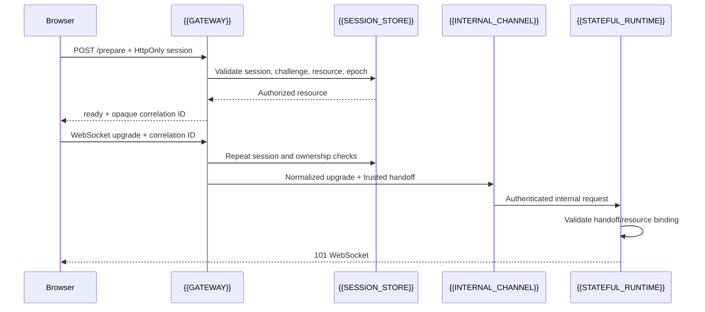

# Protected Realtime Gateway

A browser WebSocket upgrade is a public request, not proof of authorization. Put
the browser-facing connection on a gateway that can inspect its HttpOnly session,
repeat resource authorization, and forward only a normalized request to a
private stateful runtime.

## Connection sequence



Preparation improves client coordination and diagnostics. It does not reserve
access unless the adapter explicitly binds and expires that reservation. The
upgrade is the authorization boundary.

## Framework-neutral contract

```json
POST /prepare
{
  "resourceId": "{{RESOURCE_ID}}"
}

200
{
  "ready": true,
  "resourceId": "{{RESOURCE_ID}}",
  "attemptId": "{{OPAQUE_CORRELATION_ID}}"
}
```

The browser then opens a URL shaped like:

```text
wss://{{GATEWAY_ORIGIN}}/realtime/{{RESOURCE_ID}}?rid={{OPAQUE_CORRELATION_ID}}&{{PLATFORM_KEY}}={{OPAQUE_VALUE}}
```

Only explicitly required, non-secret connection metadata may appear in the
query. Never place a bearer token, JWT, session identifier, private claim,
provider assertion, or reusable capability there. The correlation ID is not a
nonce, credential, or authorization grant.

## Gateway algorithm

```text
prepare(request):
  require exact browser Origin/CSRF policy
  session = lookupHttpOnlySession(request.cookie)
  require session is active and challenge gate is satisfied
  resource = requireOwnedResource(session.principal, request.resourceId)
  epoch = authorizationEpoch(session.subject)
  return { ready: true, resourceId, attemptId: freshOpaqueId() }

upgrade(request):
  require WebSocket upgrade and exact browser Origin policy
  repeat session, challenge, resource, and authorization-epoch checks
  handoff = buildServerOwnedHandoff(session, resource)
  normalized = removeBrowserCredentialsAndArbitraryQuery(request)
  normalized = addPrivateAuthAndHandoff(normalized, handoff)
  return internalChannel.forward(normalized)
```

The gateway should map a private-channel failure to a bounded `5xx` response and
should not expose downstream headers, stack traces, claims, or provider errors.
A failed authorization should not reveal whether a foreign resource exists.

## Header and query policy

At the gateway boundary:

- accept the browser session only through the configured secure channel;
- delete browser `Cookie`, `Authorization`, and identity/correlation headers
  before forwarding;
- overwrite protected identity and request-correlation headers;
- preserve only the platform metadata required to route the connection;
- clear arbitrary query values before constructing the internal target;
- keep the resource identifier path-safe and bind it to the handoff.

At the stateful runtime boundary, reject requests that are not internal,
authenticated, upgraded WebSocket requests or whose handoff resource differs
from the runtime address.

## Preventing premature-close errors

A browser message such as
`WebSocket is closed before the connection is established` is a symptom of
failure before the socket reaches the application. Common causes include:

- an exception in a stateful runtime startup hook;
- an unavailable service binding or mismatched deployment;
- an invalid origin, session, challenge, or resource;
- upstream discovery performed synchronously during startup;
- an identity handoff that the runtime rejects before accepting the socket.

Keep startup limited to deterministic schema and identity rehydration. Move
upstream discovery and provider work after connection establishment, bound its
retries and deadline, and return an in-session error when it fails. The client
should use a bounded connection timeout, bounded retries, and an explicit retry
control rather than a render loop or unbounded reconnect storm.

## Adapter note

Map the browser route, connection metadata, private forwarding, and platform
upgrade response in the
[[authenticated-identity-blueprint/08-cloudflare-adapter|platform adapter note]].
Keep public route names and deployment observations out of this portable
contract.
