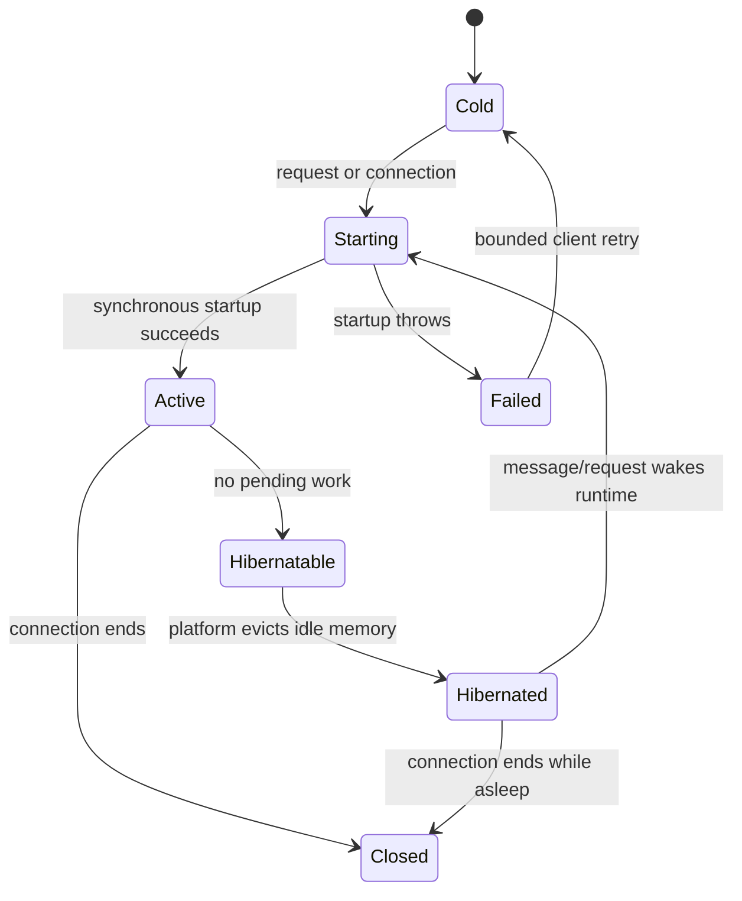

# Stateful Runtime and Hibernation

A stateful runtime should own one explicit coordination scope, persist the minimum
authoritative identity/state, and treat memory as disposable. Hibernation is a
lifecycle optimization, not an authorization boundary.

## Lifecycle model



The platform may keep the network connection alive while discarding in-memory
state. A restart runs the constructor/startup path again. Persist anything
required to authorize or continue work before entering an idle state.

## Startup contract

```text
onStart():
  create or verify durable schema
  load minimal identity/state from durable storage
  do not call external services
  do not wait for upstream discovery
  emit only an allowlisted lifecycle event
  return deterministically
```

`onConnect` (or the platform equivalent) receives the authenticated handoff
after startup. It validates the resource binding, persists the current identity
when needed, and only then accepts application messages.

Do not use a class field, process-global cache, timer, or unresolved promise as
the sole source of identity or authorization. After hibernation, those values
may be gone or stale.

## Lazy upstream work

MCP discovery, provider initialization, external API calls, and other network
dependencies belong after the connection boundary. Use one absolute deadline
for discovery and recovery, bounded attempts/backoff, and a stable application
response when the dependency is unavailable. The connection can remain
authorized and readable even when the next model/data operation cannot proceed.

This separation prevents an upstream outage from becoming a handshake outage.
It also makes the failure visible at the layer that owns the dependency instead
of as an opaque browser close.

## Realtime interruption policy

- establish a finite connection timeout;
- retry only a bounded number of times;
- clear stale correlation data before a fresh preparation;
- preserve read-only history when a new turn cannot start;
- expose a retry action inside the owning UI;
- stop and investigate any unexpected cross-resource message.

A reconnect must not silently reuse a credential that was intended for a prior
resource or session. If a platform uses connection attachments, persist only
the minimum non-secret state and treat the attachment as invalid after the
connection closes.

## Adapter obligations

Document the platform’s wake, eviction, connection-attachment, and restart
semantics in the
[[authenticated-identity-blueprint/08-cloudflare-adapter|platform adapter note]].
Record which durable store is authoritative, which lifecycle hook is
synchronous, and where lazy upstream work begins. Recheck those claims after a
runtime, SDK, or compatibility-date change.
