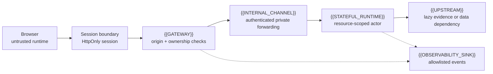

# Universal Authenticated Identity and Realtime Gateway Blueprint

This is a reusable design for protecting browser-initiated realtime connections
without placing reusable bearer credentials in URLs, browser storage, or
observability streams. It separates a portable security contract from the
platform adapter that supplies sessions, private service calls, and stateful
runtime behavior.

The intended readers are engineers and Luna agents adapting the pattern to
another application, language, or hosting platform. The universal sections use
placeholders; platform-specific names are deliberately kept in
[[authenticated-identity-blueprint/08-cloudflare-adapter|the adapter note]].

## What this blueprint guarantees

- The browser proves a server-owned session through an HttpOnly channel; it
  never receives a reusable realtime bearer credential.
- A public gateway rechecks origin, session, resource ownership, and any
  challenge or pause gate on the actual upgrade.
- An authenticated private channel carries a narrowly shaped identity handoff
  to the stateful runtime.
- The runtime binds the handoff to one resource and rehydrates durable state
  before accepting work.
- Upstream discovery and other failure-prone I/O are lazy, so an outage cannot
  strand the initial WebSocket handshake.
- Diagnostics and browser audits expose only allowlisted lifecycle data.
- Rollout, revocation, rollback, and evidence are separate decisions.

A request or attempt identifier is correlation data, not authorization. It may
help join a preparation request to an upgrade in logs, but possession of it
must never grant access.

## Architecture at a glance

The diagram is conceptual. A platform may combine the session boundary and
gateway, or may provide a built-in actor router. The invariants in the focused
notes remain binding even when the components are renamed.

## Navigation

- [[authenticated-identity-blueprint/CONTEXT|Blueprint vocabulary]]
- [[authenticated-identity-blueprint/01-vocabulary-and-trust-boundaries|Vocabulary and trust boundaries]]
- [[authenticated-identity-blueprint/02-authentication-and-session-lifecycle|Authentication and session lifecycle]]
- [[authenticated-identity-blueprint/03-identity-handoff-and-authorization|Identity handoff and authorization]]
- [[authenticated-identity-blueprint/04-protected-realtime-gateway|Protected realtime gateway]]
- [[authenticated-identity-blueprint/05-stateful-runtime-and-hibernation|Stateful runtime and hibernation]]
- [[authenticated-identity-blueprint/06-observability-redaction-and-testing|Observability, redaction, and testing]]
- [[authenticated-identity-blueprint/07-rollout-revocation-and-recovery|Rollout, revocation, and recovery]]
- [[authenticated-identity-blueprint/08-cloudflare-adapter|Cloudflare adapter]]
- [[authenticated-identity-blueprint/09-sequential-checkpoints|Luna checkpoints]]
- [[authenticated-identity-blueprint/audits/repository-map|Repository map]]
- [[authenticated-identity-blueprint/audits/evidence-ledger|Evidence ledger]]
- [[authenticated-identity-blueprint/audits/unresolved-questions|Unresolved questions]]
- [[authenticated-identity-blueprint/references/standards-and-platforms|Standards and platform references]]

## How to reuse it

1. Replace `{{RESOURCE_ID}}` with the application’s protected coordination
   unit: a room, document, user workspace, job, or thread.
2. Name the principal, session store, gateway, private channel, stateful
   runtime, upstream dependencies, and observability sink.
3. Implement the contracts and invariants before choosing framework-specific
   helpers.
4. Complete the checkpoints in order and record the evidence surface for each
   claim.
5. Keep the adapter and evidence ledger current when a route, binding, SDK,
   storage schema, or deployment changes.

## Evidence language

Use `verified-repository` for source, configuration, tests, or local tooling;
`verified-external` for an authoritative standard or platform document;
`verified-live` for representative deployed behavior; `inference` for a
named deduction; `assumption` for an adoption premise; `unknown` when the
check is unavailable; and `potentially-outdated` when the evidence may no
longer describe the deployed revision.

The universal core must not contain secrets, copied provider manuals, raw
cookies, JWTs, private keys, prompts, or raw runtime telemetry. Put mutable
deployment observations in the evidence ledger, not in the contract notes.
