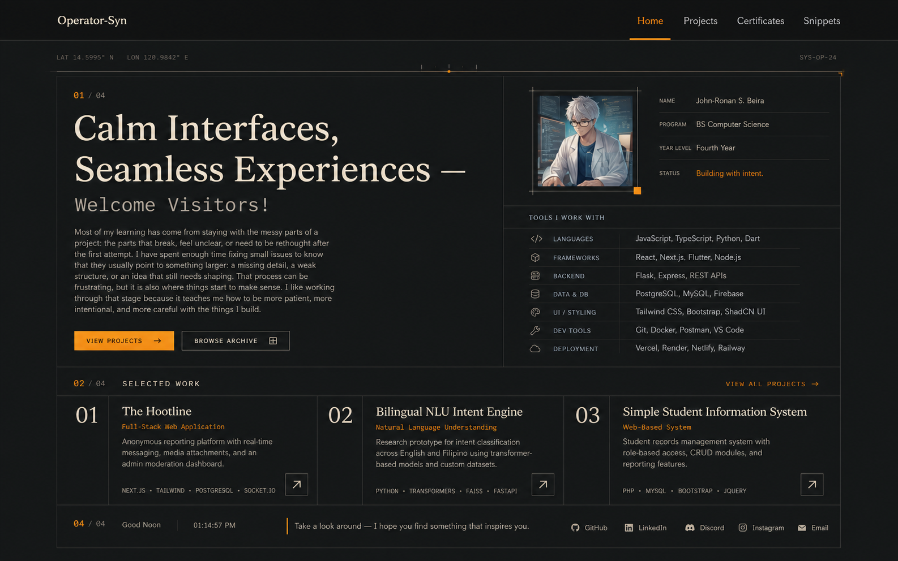
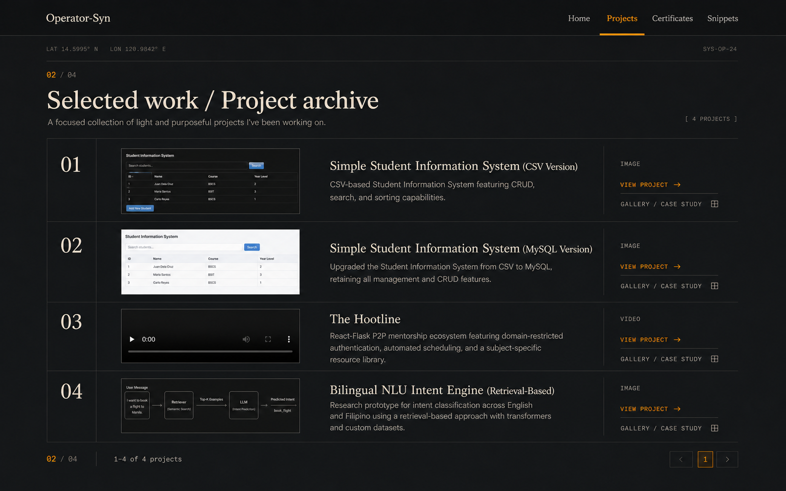
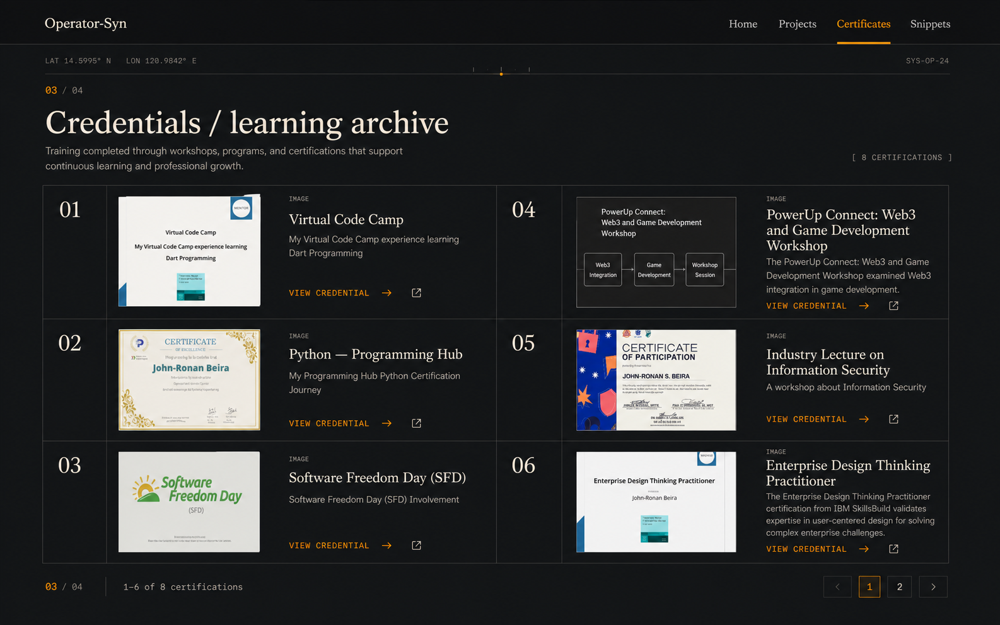
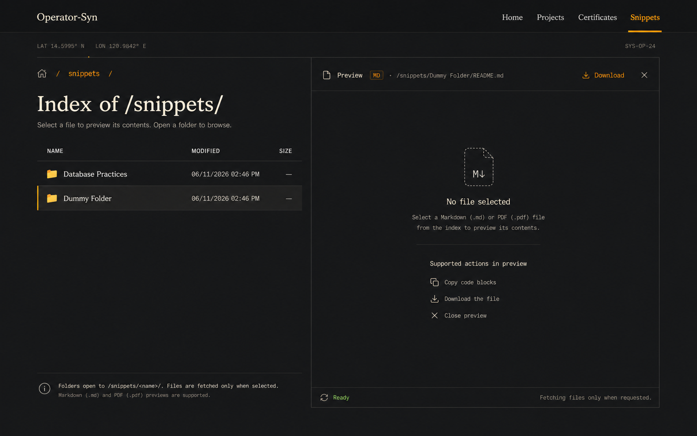

# Portfolio Visual References

These generated PNGs are the visual reference set for the current revamp. They
are stored in the vault so later implementation and visual QA can compare the
rendered routes against the agreed composition without relying on chat history
or an external image location.

## Routes

### Home

Identity leads the page, followed by the profile note, tool loadout, profile
metadata, links, and the archive entry point.

### Projects

Projects use an indexed media archive. The visible content comes from the
existing project and gallery responses; the numbered rows and amber actions are
presentation only.

### Certificates

Certificates use the same archive grammar while emphasizing credential media,
descriptions, credential links, and existing pagination.

### Snippets

Snippets use a technical file-index grammar with path, modified time, size,
folder navigation, and a Markdown/PDF preview state.

## Hidden application surfaces

The 2026-08-26 reference captures for the hidden application routes are:

- image-1.png — NetBird private-access surface:
  /home/yashindo/.codex/attachments/1672c205-fbaf-4436-93ce-817b41d428c9/image-1.png
- image-2.png — Atelier portfolio-dashboard surface:
  /home/yashindo/.codex/attachments/1672c205-fbaf-4436-93ce-817b41d428c9/image-2.png

They record the legacy blue-glass hero, blue fact rail, rounded verification
card, and pill actions. The shared StaticAppPage keeps each application's
verified copy, facts, and policy destinations while translating the presentation
to the current cream/amber palette, coordinate rail, ruled surfaces, square
controls, and responsive archive bands. The attachment paths are audit
provenance only; they are not runtime assets or API/database fixtures.

The optional Of Times Old theme uses the historical blue palette audited from
`origin/main` as reference rather than as a source to copy. It is a newly
composed, lighter, low-chroma pastel-blue monochrome ramp that keeps the Dalan
geometry and remaps only semantic color roles. Vesper Index is a separate
rose-led twilight option inspired by the Twilight-5 sunset balance. The Ancient
Blue Ledger is a permanent light ledger palette promoted from the local custom
theme format; it keeps the same composition while using blue-tinted surfaces,
rules, and depth.

## Evidence boundary

The images are design references, not screenshots of a new implementation and
not API fixtures. Generated labels such as section indexes, visual type labels,
and decorative coordinates must not become new database fields unless a later
product requirement explicitly adds them.

The implementation remains bound to [[api/routes|the current API routes]],
[[database/schema|the current D1 schema]], and [[design-system/tokens|the shared
tokens]].
