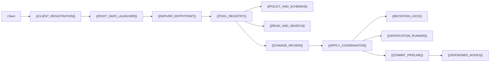

# Universal Repository MCP Structure Blueprint

This vault is a reusable implementation blueprint for a local repository MCP.
It is written for a future maintainer or Luna to reproduce the same safety,
review, verification, and commit boundaries in another repository.

The directory name preserves the requested compatibility spelling
`docs/univsersal-repository-mcp-structure/`; the title and aliases use the
corrected Universal spelling.

## Scope and boundary

This blueprint covers a repository-owned, local MCP server that operates on one
canonical Git checkout. The current implementation is
`tools/repository-mcp/`, launched over stdio. It has no public HTTP endpoint,
portfolio tools, resources, deployment path, migration path, or Cloudflare
credential access. The separate public Worker is linked only as a boundary:
[[architecture/portfolio-mcp|Public Portfolio MCP (Streamable HTTP)]].

Generic sections use placeholders such as `{{SERVER_NAME}}` and
`{{PROJECT_ROOT_ENV}}`. Current repository values are kept in explicitly marked
`Current implementation mapping` sections so the blueprint remains portable.

## Current verified baseline

| Surface | Current evidence |
| --- | --- |
| Server identity | `operator-synaciel-repository`, protocol version `2.0.0` |
| Transport | `StdioServerTransport` from `tools/repository-mcp/src/server.ts` |
| Tools | 13 tools registered by `registerRepositoryTools` |
| Read/write profiles | `app`, `docs`, `mcp`, `database`, `config`, `repository` |
| Verification profiles | `mcp-fast`, `app`, `docs`, `mcp`, `database`, `config`, `repository`, `full` |
| Safety contract | canonical Git root, profile paths, hashes, bounded text, redaction, rollback |
| Current checks | `npm run test:mcp`: 90 passing; `docs:check` and `skills:check` passing |
| Runtime evidence | local workflow status returned `ready` with active `.githooks` |

## Architecture and data flow

The current relation graph is recorded in
[[univsersal-repository-mcp-structure/audits/repository-map|the repository map]].
The main protocol sequence is:

1. Discover and validate the canonical repository root.
2. Register tools and strict schemas.
3. Read/search within a selected profile.
4. Prepare a hash-bound change and review its bounded diff.
5. Apply only after explicit approval; recheck hashes under the checkout lock.
6. Verify with a fixed profile.
7. Hand the exact reviewed operation to the one-file commit pipeline.

## Navigation

- [[univsersal-repository-mcp-structure/01-vocabulary-and-configuration|Vocabulary and configuration]]
- [[univsersal-repository-mcp-structure/02-registration-and-bootstrap|Registration and bootstrap]]
- [[univsersal-repository-mcp-structure/03-tool-registry-and-contracts|Tool registry and contracts]]
- [[univsersal-repository-mcp-structure/04-policy-profiles-and-path-safety|Policy, profiles, and path safety]]
- [[univsersal-repository-mcp-structure/05-read-search-and-permissions|Reads, search, and permissions]]
- [[univsersal-repository-mcp-structure/06-change-preparation-and-diff|Change preparation and diff]]
- [[univsersal-repository-mcp-structure/07-apply-rollback-and-concurrency|Apply, rollback, and concurrency]]
- [[univsersal-repository-mcp-structure/08-verification-and-status|Verification and status]]
- [[univsersal-repository-mcp-structure/09-commit-pipeline-and-hooks|Commit pipeline and hooks]]
- [[univsersal-repository-mcp-structure/10-errors-security-and-boundaries|Errors, security, and boundaries]]
- [[univsersal-repository-mcp-structure/11-tests-maintenance-and-drift|Tests, maintenance, and drift control]]
- [[univsersal-repository-mcp-structure/12-sequential-checkpoints|Sequential implementation checkpoints]]
- [[univsersal-repository-mcp-structure/audits/repository-map|Repository map]]
- [[univsersal-repository-mcp-structure/audits/evidence-ledger|Evidence ledger]]
- [[univsersal-repository-mcp-structure/audits/unresolved-questions|Unresolved questions]]

## Evidence and maintenance

Source, configuration, and tests establish repository behavior. They do not prove
deployment or live behavior for a local-only server. Claims use the statuses
`verified-repository`, `inference`, `assumption`, or `unknown`. Update the
nearest focused note whenever a source symbol, tool, profile, limit, hook,
configuration entry, or test contract changes. The source-to-note ownership
matrix and drift test live in
[[univsersal-repository-mcp-structure/11-tests-maintenance-and-drift|maintenance and drift control]].
